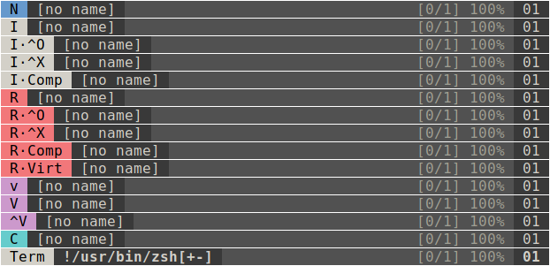
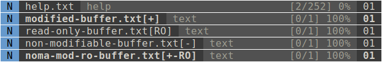

lyne.vim
========

a fast, customizable statusline for vim power-users

## defaults

There are defaults so that lyne.vim will work out of the box. However, you are
expected to customize lyne.vim to fit your needs. This plugin can be as simple
and as fast as the built-in statusline, or it can be as complex and stylish as
you wish. lyne.vim supports complex configurations but with minimal
configuration can be styled dramatically and can easily be powerlined.

While powerline symbols are not set by default, since this will not render in
terminals that don't use a patched powerline font, lyne.vim defaults to
supporting powerline symbols. Supporting powerline separators and also the
default styling for buffers and buffer flags requires a small amount of
overhead. Since this may not be suitable to every power-user, these functions
are stored into pre- and post-function lists, either of which can be disabled or
set to a new list. This is covered in further detail below in
[configuration](#Configuration).


## configuration

### active and inactive lyne

In order to change the components of the statusline, you can change
`g:lyne_active` and `g:lyne_inactive`. `g:lyne_active` represents how the
_active_ lyne will look (the active lyne is the statusline in the current
window), while `g:lyne_inactive` represents how the _inactive_ lyne will look
(the other lynes in all of the inactive windows).

Each is a dict that can contain `'left'` and `'right'` keys that map to a list
of _tokens_ that describe the statusline.

Each _token_ (described in further detail in [lyne tokens](#lyne=tokens)) is
comprised of three parts:
1. __type__: a single character that denotes the _token type_
    - `h`: new **h**ighlight segment
    - `r`: **r**ecurring function call
    - `f`: **f**unction (called once)
    - `e`: raw **e**xpression
2. __flag__: a single character that denotes _token padding_
    - `:`: pad both sides with a non-breaking space
    - `<`: flush left (pad right-side)
    - `>`: flush right (pad left-side)
    - `|`: no padding on either side

3. __data__: treated specially for each token type
    - `h`: highlight group name
    - `r`: recurring function name as a string
    - `f`: function name as a string
    - `e`: raw expression as a string

It is more easily shown with an example. The defaults are as follows:

```vim
let g:lyne_active = {
\	'left': [
\		'h|LyneMode', 'r:lyne#get_mode',
\		'h|LyneBufname', 'r>lyne#utils#get_bufname', 'e|%<', 'r<lyne#utils#get_bufflags',
\		'h|StatusLine', 'e>%{&filetype}'
\	],
\	'right': ['e<[%l/%L] %p%%', 'h|LyneBufname', 'e:%02v']
\}

let g:lyne_inactive = {
\	'left': ['e:%f%<%h%w%m%r'],
\	'right': ['e:%p%%']
\}
```

Note that if you simply do `let g:lyne_active = {'left':'e:%f'}`, for example,
then this does not overwrite `g:lyne_active.right`, nor of course, does it set
either `g:lyne_inactive.left` or `g:lyne_inactive.right`.


### lyne tokens

As was briefly mentioned, each _token_ is comprised of three parts: a type, a
flag, and data.

Since the flag is the easiest to understand, let's start with that. The flag is
always the second character in the token, and it determines what kind of padding
the token will use. `:` pads the token with space on both sides, `<` pads space
only on the right, `>` pads space only on the left, and `|` adds no space.

I have opted to use `|` for all of the highlight groups in the default settings,
so you might have noted `h|LyneMode`, `h|LyneBufname`, etc in the defaults. This
is because I have added space around the other components, and so that there are
not too many spaces, I use `|` around the highlight tokens.

The token token type is determined by the first character, and can only be one
of `h` (highlight token), `r` (recurring function token), `f` (one-time
function), or `e` (raw expression token). The are intricacies highlighted below
by showing example tokens.

- `'h|LyneMyName'`
    - if this is the first highlight group for the left or right lyne, then
      simply start a new highlight group called `LyneMyName`
    - if there is already another highlight group, then add a separator from
      `g:lyne_separators.{left,right}` (depending on the side) and then start
      the new highlight group
    - `|`: there will be no padding on either side of this token
- `'h|LyneMyName::'`
    - this is the same as the first example except `:` is used as the separator
      instead of `g:lyne_separator.{left,right}`
    - the second `:` can be replaced with any string
- `'r>lyne#utils#get_bufname`
    - show the buffer name using a lyne utility function
    - `>`: pad the token with a space on the left
- `'r:fugitive#statusline'`
    - show the git branch with `fugitive#statusline()` (must install tpope's
      fugitive plugin)
    - if the function is not found, then the errors are ignored with `silent!`
    - `:`: pad both sides of the token with space
- `'e:%f%<%m%r'`
    - adds an expression which is interpreted by the statusline only and is not
      evaluated by lyne
    - therefore, the statusline expands `%f` to the buffer name, `%<` is the
      truncation indicator, `%m` indicates if the buffer has been modified or is
      modifiable, and `%r` indicates if the buffer is read-only
    - `:`: pad both sides of the token with space


### settings

Besides `g:lyne_active` and `g:lyne_inactive` there are a few other settings
that allow you to change the behavior of lyne or customize it further.

#### g:lyne\_separators
A dict that changes the default separators between highlight segments. The dict
should contain only `'left'` and `'right'` keys that map to strings. This is the
default:

```vim
let g:lyne_separators = {'left':'', 'right':''}
```

#### g:pre\_functions and g:post\_functions

`g:pre_functions` and `g:post_functions` are two list that are respectively run
before and after statusline evaluation each time the statusline is being updated
by vim. This is achieved by adding `%{lyne#pre()}` and `%{lyne#pos()}` to the
beginning and end of the statusline. If at compile time`len(g:pre_functions) ==#
0` then `%{lyne#pre}` is not added to the statusline, and if
`%{len(g:post_function} ==#` then `%{lyne#post}` is not added. Here are the
defaults:

```vim
let g:lyne_pre_functions = []
let g:lyne_post_functions = ['lyne#utils#update_bufname', 'lyne#utils#update_mode', 'lyne#utils#update_separators']
```

Each function is passed `c` and `winnr` as the two parameters. `c` is `1` if the
lyne is an _active_ lyne or `0` if it is an _inactive_ lyne. `winnr` is the
window number of the lyne.

The default pre- and post-functions are used to style the statusline and support
powerline out of the box. Their purposes are discussed further in
[lyne utils](#lyne-utils), but they are briefly mentioned here.

- `lyne#utils#update_bufname`: color the output of `lyne#utils#get_bufname`
- `lyne#utils#utils#update_mode`: color the output of `lyne#utils#get_mode`
- `lyne#utils#update_separators`: update the separators between each highlight
  segment
    - this is necessary if the separators change color (for example with
      powerline separators)

#### g:pre\_compile\_functions and g:post\_compile\_functions

These two are lists of functions (stored as strings—note that `<sid>` will not
work in the list even if wrapped in a `function()`) that are called before and
after (resp) the lynes are compiled.

Each function that is called is passed the two args `c` and `-1`. `c` is `1` if
the lyne will be an _active_ lyne or `0` if it will be an _inactive_ lyne.

#### g:lyne\_mode\_hl

This links each potential `mode(1)` output to a highlight group name. Each name
will be prefixed with `'LyneMode'`. Here are the defaults:

```vim
let g:lyne_mode_hl = {
\	'n'        : 'Normal',
\	'no'       : 'Normal',
\	'nov'      : 'Normal',
\	'noV'      : 'Normal',
\	"no\<c-v>" : 'Normal',
\	'niI'      : 'Insert',
\	'niR'      : 'Replace',
\	'niV'      : 'Visual',
\	'v'        : 'Visual',
\	'V'        : 'Visual',
\	"\<c-v>"   : 'Visual',
\	's'        : 'Visual',
\	'S'        : 'Visual',
\	"\<c-s>"   : 'Visual',
\	'i'        : 'Insert',
\	'ic'       : 'Insert',
\	'ix'       : 'Insert',
\	'R'        : 'Replace',
\	'Rc'       : 'Replace',
\	'Rv'       : 'Replace',
\	'Rx'       : 'Replace',
\	'c'        : 'Command',
\	'cv'       : 'Term',
\	'ce'       : 'Term',
\	'r'        : 'Prompt',
\	'rm'       : 'Prompt',
\	'r?'       : 'Prompt',
\	'!'        : 'Term',
\	't'        : 'Term'
\}
```

For example in normal mode, `mode(1)` returns `'n'`, which is then mapped to
the `'LyneModeNormal'` highlight group.

Note that if you only have a subset of the above keys, then the defaults are
extended and not overwritten. This makes it possible to change just one or a few
mode highlights.

#### g:lyne\_mode\_map

In addition to a mode highlight map, there is also a mode map settings,
`g:lyne_mode_map` which maps each `mode(1)` to a string. Here are the defaults:

```vim
let s:mode_map = {
\	'n'        : 'N',
\	'no'       : 'N·OP',
\	'nov'      : 'N·OP·v',
\	'noV'      : 'N·OP·V',
\	"no\<c-v>" : 'N·OP·^V',
\	'niI'      : 'I·^O',
\	'niR'      : 'R·^O',
\	'niV'      : 'V',
\	'v'        : 'v',
\	'V'        : 'V',
\	"\<c-v>"   : '^V',
\	's'        : 's',
\	'S'        : 'S',
\	"\<c-s>"   : '^S',
\	'i'        : 'I',
\	'ic'       : 'I·Comp',
\	'ix'       : 'I·^X',
\	'R'        : 'R',
\	'Rc'       : 'R·Comp',
\	'Rv'       : 'R·Virt',
\	'Rx'       : 'R·^X',
\	'c'        : 'C',
\	'cv'       : 'Ex·C',
\	'ce'       : 'Ex',
\	'r'        : 'Enter',
\	'rm'       : 'More',
\	'r?'       : 'Confirm',
\	'!'        : 'Shell',
\	't'        : 'Term'
\}
```

As with the mode highlights map, the mode map defaults will be extended instead
of replaced, so you can just specify one or a few mode maps instead of all of
them.

## utils

- `lyne#utils#update_bufname` (usually a _post-function_)
    - links `LyneBufname` to `LyneBufnameModified` or `LyneBufnameUnmodified`
      depending on whether the buffer is `&modified` or not (resp)
- `lyne#utils#update_mode` (usually a _post-function_)
    - uses `g:lyne_mode_hl` to map the `LyneMode` highlight group to the correct
      highlight group
    - for example, using the defaults, in normal mode, `LyneMode` will be linked
      to `LyneModeNormal` (since `g:lyne_mode_hl.n ==# 'Normal'`)
- `lyne#utils#update_separators` (usually a _post-function_)
    - iterate over each separator and update the highlight group
    - this is more expensive than the other util functions, but is required for
      powerline or if the separators' colors shoule be recomputed
- `lyne#utils#get_bufname` (usually a _r-token_)
    - get the buffer name; while similar to `e:%f`, it is slightly different and
      only achievable in a function
- `lyne#utils#get_bufflags` (usually a _r-token_)
    - get the buffer flags; while similar to `e:%m%r`, it is slightly different
      and only achievable in a function

## debugging

If there is an invalid token _type_, then it will not be added. However, the
token _flags_ are not checked for validity.

To see the pre-compiled lyne, use either `:echo lyne#get_active()` or `:echo
lyne#get_inactive()`. These two dicts are compiled to the active and inactive
lynes in `lyne#setup()`. For example:

```vim
:echo lyne#get_active().left
['h:LyneMode', 'r:lyne#get_mode', 'h:LyneBufname', 'r>lyne#utils#get_bufname', 'e|%<', 'r<lyne#utils#get_bufflags', 'h:StatusLine', 'e:%{&filetype}']
```

To see the current window's compiled statusline, use `:echo &statusline`. To see
all of the windows' statuslines, use `:echo map(range(1, winnr('$')), { i,n ->
'win '.n.': '.getwinvar(n, '&statusline') })`. For example:

```vim
:echo &statusline
%{lyne#pre()}%#LyneMode#%{lyne#func_wrap('lyne#get_mode',1,':')}%#LyneBufname#%{lyne#func_wrap('lyne#utils#get_bufname',1,'>')}%<%{lyne#func_wrap('lyne#utils#get_bufflags',1,'<')}%#StatusLine# %{&filetype}%=[%l/%L] %p%% %#LyneBufname# %02v %{lyne#post()}
```

## pics

### various lyne modes



### various buffers




## todo

1. Allow for restrictions somehow based on arbitrary functions (or maybe things
   like window width, filetype, etc ... or maybe both)
2. Maybe add a g-token for "group" which is like an e-token but wraps everything
   (including padding) in a group like `%(..%)`
3. Continue adding features for flexibility and power while simplifying if
   possible
    - re-check airline and lightline for powerful features that can be
      implemented

